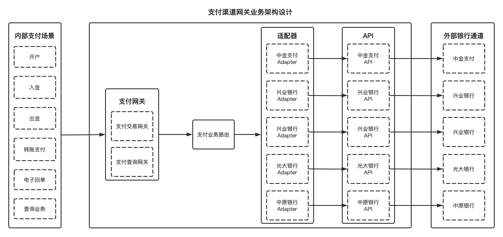
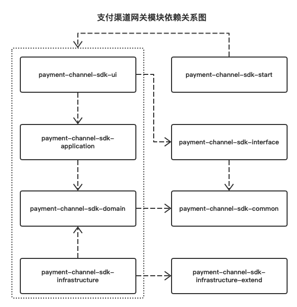

# payment-system

## 支付系统说明

### 支付渠道网关系统

支付渠道网关系统是企业内部业务系统与外部支付通道的的桥接系统，对外部负责对接支付通道的提供的API，对内部负责提供统一支付场景网关，同时需要根据支付请求自动适配支付渠道API。

支付渠道网关系统的业务需求如下图：

支付渠道网关模块依赖关系图如下： 

- **payment-channel-sdk-ui：** 支付渠道网关用户接口层，是http请求、RPC远程过程调用、消息订阅、领域事件订阅的基础入口，与支付渠道网关应用层交互。
- **payment-channel-sdk-application：** 支付渠道网关应用层，通过接收支付渠道网关用户接口层的请求和编排支付渠道网关领域层服务，向支付渠道网关用户接口层输出结果。
- **payment-channel-sdk-domain：** 支付渠道网关领域层，包括支付渠道适配器模型、支付渠道路由策略模型及策略上下文模型、支付渠道网关领域服务。通过与支付渠道网关基础设施层交互获取外部数据支撑能力，向支付渠道网关应用层输出结果。
- **payment-channel-sdk-infrastructure：** 支付渠道网关基础设施层，负责外部支付通道API对接和底层技术细节实现。
- **payment-channel-sdk-infrastructure-extend：** 支付渠道网关基础设施层扩展依赖，用于封装外部支付通道的Jar包依赖及源代码维护。
- **payment-channel-sdk-interface：** 支付渠道网关RPC接口层，对其它内部业务系统提供支付能力。
- **payment-channel-sdk-common：** 支付渠道网关公共依赖包，提供支付渠道网关通用的实体、数据传输对象、枚举、工具等。
- **payment-channel-sdk-start：** 支付渠道网关服务启动包。

