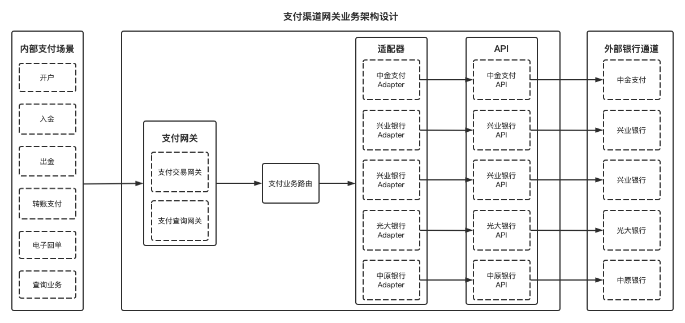
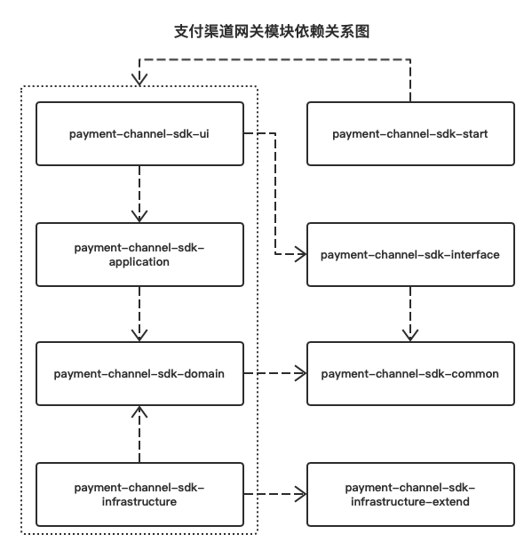

# payment-system


> 企业级支付系统，基于领域驱动设计 (DDD) 构建

## 项目简介

payment-system 是一个企业级支付系统，核心为支付渠道网关，负责桥接企业内部业务系统与外部支付通道。系统采用领域驱动设计 (DDD) 架构，支持多种支付渠道的统一接入和管理。

### 主要特性

- ✅ 多支付渠道适配（中信银行、中金支付等）
- ✅ 统一的支付网关接口
- ✅ 智能支付路由策略
- ✅ 领域驱动设计 (DDD) 分层架构
- ✅ Dubbo RPC 服务化

## 技术栈

| 技术 | 版本 | 说明 |
|------|------|------|
| Java | 21 | 开发语言 |
| Spring Boot | 3.4.0 | 应用框架 |
| Apache Dubbo | 3.2.12 | RPC 框架 |
| Lombok | 1.18.32 | 简化代码 |
| Hutool | 5.8.4 | 工具库 |
| Jackson | 2.18.1 | JSON 处理 |
| Dom4j | 2.1.3 | XML 处理 |

## 项目结构

```
payment-system/
├── payment-channel-sdk-*          # 支付渠道网关 SDK（核心）
│   ├── payment-channel-sdk-ui            # 用户接口层
│   ├── payment-channel-sdk-application   # 应用层
│   ├── payment-channel-sdk-domain        # 领域层
│   ├── payment-channel-sdk-infrastructure # 基础设施层
│   ├── payment-channel-sdk-infrastructure-extend # 扩展依赖
│   ├── payment-channel-sdk-interface     # RPC 接口层
│   └── payment-channel-sdk-common        # 公共依赖
├── payment-core                   # 支付核心服务
│   ├── payment-account-service          # 账户服务
│   └── payment-channel-service          # 渠道服务
├── payment-sdk                    # 支付 SDK
│   ├── payment-account-sdk             # 账户 SDK
│   ├── payment-channel-sdk             # 渠道 SDK
│   ├── payment-common-sdk              # 公共 SDK
│   └── payment-outreach-sdk            # 外联 SDK
├── payment-client                 # 支付客户端
│   └── console-app                    # 控制台应用
├── payment-infrastructure         # 支付基础设施
│   └── payment-outreach-service        # 外联服务
└── docs                           # 文档
    └── images                         # 架构图
```

### 模块详细说明

- **[payment-channel-sdk-ui](file:///workspace/payment-channel-sdk-ui)**: 支付渠道网关用户接口层，是 http 请求、RPC 远程过程调用、消息订阅、领域事件订阅的基础入口，与支付渠道网关应用层交互。
- **[payment-channel-sdk-application](file:///workspace/payment-channel-sdk-application)**: 支付渠道网关应用层，通过接收支付渠道网关用户接口层的请求和编排支付渠道网关领域层服务，向支付渠道网关用户接口层输出结果。
- **[payment-channel-sdk-domain](file:///workspace/payment-channel-sdk-domain)**: 支付渠道网关领域层，包括支付渠道适配器模型、支付渠道路由策略模型及策略上下文模型、支付渠道网关领域服务。通过与支付渠道网关基础设施层交互获取外部数据支撑能力，向支付渠道网关应用层输出结果。
- **[payment-channel-sdk-infrastructure](file:///workspace/payment-channel-sdk-infrastructure)**: 支付渠道网关基础设施层，负责外部支付通道 API 对接和底层技术细节实现。
- **[payment-channel-sdk-infrastructure-extend](file:///workspace/payment-channel-sdk-infrastructure-extend)**: 支付渠道网关基础设施层扩展依赖，用于封装外部支付通道的 Jar 包依赖及源代码维护。
- **[payment-channel-sdk-interface](file:///workspace/payment-channel-sdk-interface)**: 支付渠道网关 RPC 接口层，对其它内部业务系统提供支付能力。
- **[payment-channel-sdk-common](file:///workspace/payment-channel-sdk-common)**: 支付渠道网关公共依赖包，提供支付渠道网关通用的实体、数据传输对象、枚举、工具等。

## 业务功能

### 支付渠道网关支持的功能

| 功能 | 说明 |
|------|------|
| 转账 | 单笔转账 |
| 批量转账 | 批量转账处理 |
| 余额查询 | 账户余额查询 |
| 账户开户 | 开立支付账户 |
| 账户认证 | 账户实名认证 |
| 网银充值 | 网银充值 |
| 提现 | 账户提现 |
| 交易查询 | 交易状态查询 |
| 电子回单 | 电子回单下载/查询 |
| 银行信息查询 | 银行列表、支行信息查询 |

## 架构设计

### 业务架构

支付渠道网关系统是企业内部业务系统与外部支付通道的桥接系统，对外部负责对接支付通道提供的 API，对内部负责提供统一支付场景网关，同时需要根据支付请求自动适配支付渠道 API。



### 模块依赖关系



### 分层架构

系统采用领域驱动设计 (DDD) 四层架构：

1. **用户接口层 (UI)** - 处理 HTTP、RPC 请求
2. **应用层 (Application)** - 业务流程编排
3. **领域层 (Domain)** - 核心业务逻辑、领域模型
4. **基础设施层 (Infrastructure)** - 外部通道对接、技术实现

### 设计模式

- **策略模式** - 支付路由策略（[TransferAccountRouteStrategy](file:///workspace/payment-channel-sdk-domain/src/main/java/cn/tyrone/payment/channel/domain/route/strategy/TransferAccountRouteStrategy.java)）
- **适配器模式** - 支付渠道适配（[ICommunalPaymentServiceAdapter](file:///workspace/payment-channel-sdk-domain/src/main/java/cn/tyrone/payment/channel/domain/adapter/ICommunalPaymentServiceAdapter.java)）

## 快速开始

### 环境要求

- JDK 21+
- Maven 3.8+

### 编译构建

```bash
# 克隆项目
git clone <repository-url>

# 进入项目目录
cd payment-system

# 编译项目
mvn clean install -DskipTests
```

### 运行项目

```bash
# 启动支付渠道网关服务
# (待完善启动模块说明)
```

## 配置说明

支付渠道配置通过 `PaymentChannelConfig` 枚举管理，支持配置：

- 渠道编码
- 网关类型
- 连接参数
- 证书配置

## 开发指南

### 新增支付渠道

1. 实现 `ICommunalPaymentServiceAdapter` 接口
2. 在 `domain` 层添加对应的路由策略
3. 在 `infrastructure` 层实现渠道对接

### 代码规范

- 遵循阿里巴巴 Java 开发手册
- 使用 Lombok 简化代码
- 完善日志记录

## 贡献指南

欢迎提交 Issue 和 Pull Request！

1. Fork 本仓库
2. 创建特性分支 (`git checkout -b feature/AmazingFeature`)
3. 提交更改 (`git commit -m 'Add some AmazingFeature'`)
4. 推送到分支 (`git push origin feature/AmazingFeature`)
5. 提交 Pull Request

## 许可证

本项目采用 Apache License 2.0 许可证 - 详见 [LICENSE](LICENSE) 文件

## 相关链接

- [支付系统设计专栏](https://shanglishuai.blog.csdn.net/article/details/120069286)

## 联系方式

- 作者：shanglishuai
- 博客：https://shanglishuai.blog.csdn.net/

